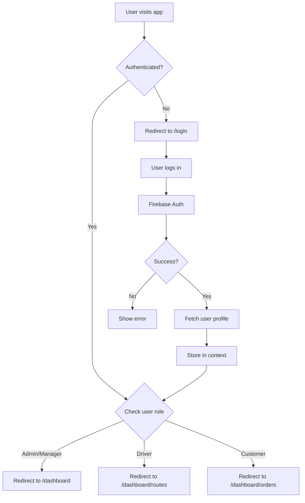

# FleetFlow: Modular Fleet & Logistics Management System

A comprehensive, modern fleet and logistics management system built with Next.js and Firebase. FleetFlow provides real-time tracking, route optimization, vehicle management, and analytics for transportation and logistics operations.

## � Documentation

- **[TanStack Query Guide](./TANSTACK_QUERY_GUIDE.md)** - Complete guide for using TanStack Query with Firebase services
- [Architecture Overview](#️-architecture-overview)
- [Installation Guide](#-installation)
- [Development Workflow](#-development-workflow)
- [Firebase Schema](#-firebase-database-schema)  
- [API Documentation](#️-api-routes-documentation)

- [Troubleshooting](#-troubleshooting-guide)
- [Code Examples](#-code-examples)

## �🚀 Features

### Core Modules

- **Fleet Management**
  - Vehicle inventory and tracking
  - Maintenance scheduling and history
  - Fuel consumption monitoring
  - Vehicle document management
  - Real-time vehicle status and location

- **Driver Management**
  - Driver profiles and credentials
  - License and certification tracking
  - Performance metrics and analytics
  - Shift scheduling and time tracking
  - Driver assignment and availability

- **Route Planning & Optimization**
  - Intelligent route planning
  - Real-time traffic integration
  - Multi-stop route optimization
  - Delivery scheduling
  - ETA calculations

- **Order & Shipment Tracking**
  - Order management system
  - Real-time shipment tracking
  - Proof of delivery
  - Customer notifications
  - Delivery history and reports

- **Analytics & Reporting**
  - Fleet performance dashboards
  - Fuel efficiency reports
  - Cost analysis and budgeting
  - Driver performance metrics
  - Custom report generation

- **Maintenance Management**
  - Preventive maintenance scheduling
  - Maintenance history tracking
  - Service provider management
  - Cost tracking and budgeting
  - Automated maintenance reminders

## 🛠️ Tech Stack

- **Frontend**: Next.js 15 (App Router), React 19, TypeScript
- **Backend**: Firebase
  - Authentication (Firebase Auth)
  - Database (Cloud Firestore)
  - Storage (Firebase Storage)
  - Cloud Functions (Firebase Functions)
  - Real-time Updates (Firestore Real-time Listeners)
- **Styling**: Tailwind CSS
- **Data Fetching & Caching**: TanStack Query (React Query) v5
- **State Management**: React Context API for global state (auth, theme)
- **Maps Integration**: Google Maps API / Mapbox
- **UI Components**: shadcn/ui
- **Forms**: React Hook Form + Zod Validation

- **Code Quality**: ESLint, Prettier, TypeScript strict mode

## 🏗️ Architecture Overview

FleetFlow follows a **modular, scalable architecture** with clear separation of concerns:

### Frontend Architecture
- **App Router**: Uses Next.js 15 App Router for file-based routing
- **Server Components**: Leverages React Server Components for optimal performance
- **Client Components**: Interactive components marked with `'use client'`
- **Route Groups**: Auth and Dashboard are organized in route groups `(auth)` and `(dashboard)`
- **Parallel Routes**: Loading states and error boundaries for better UX

### Backend Architecture
- **Firebase Services**: All backend operations through Firebase SDK
- **Cloud Functions**: Serverless functions for complex operations (triggers, scheduled tasks)
- **Real-time Database**: Firestore for real-time data synchronization
- **Security Rules**: Declarative security at the database level

### Data Flow
```
User Action → Component → Custom Hook → Service Layer → Firebase → Real-time Update → UI Update
```

### State Management Strategy
- **Server State**: TanStack Query (React Query) for all Firebase data fetching, caching, and synchronization
- **Client State**: React Context for global app state (auth, theme, user preferences)
- **Form State**: React Hook Form with Zod validation for form management
- **URL State**: Next.js router (useSearchParams, useRouter) for navigation and filter state

**Why TanStack Query?**
- Automatic caching and cache invalidation
- Built-in loading and error states
- Optimistic updates support
- Request deduplication
- Background refetching
- Real-time data synchronization with Firestore
- Reduces boilerplate code significantly

## 📋 Prerequisites

Before you begin, ensure you have the following installed:
- **Node.js** 18.x or higher ([Download](https://nodejs.org/))
- **npm** / **yarn** / **pnpm** (package manager)
- **Git** for version control
- **Firebase CLI** (`npm install -g firebase-tools`)
- **VS Code** (recommended) with extensions:
  - ESLint
  - Prettier
  - Tailwind CSS IntelliSense
  - Firebase Explorer
  - TypeScript and JavaScript Language Features
- **Firebase Project**: Create one at [Firebase Console](https://console.firebase.google.com/)
- **Google Cloud Project**: For Maps API (if using maps features)

## 🔧 Installation

1. **Clone the repository**
   ```bash
   git clone <repository-url>
   cd fleetflow
   ```

2. **Install dependencies**
   ```bash
   npm install
   # or
   yarn install
   # or
   pnpm install
   ```

   **Key Dependencies:**
   - `@tanstack/react-query` - Data fetching and caching
   - `@tanstack/react-query-devtools` - Development tools for React Query
   - `firebase` - Firebase SDK
   - `react-hook-form` - Form management
   - `zod` - Schema validation
   - `@react-google-maps/api` - Google Maps integration
   - `shadcn/ui` - UI components
   
   **Install TanStack Query:**
   ```bash
   npm install @tanstack/react-query @tanstack/react-query-devtools
   ```

3. **Configure Firebase**
   
   Create a `.env.local` file in the root directory with your Firebase configuration:
   ```env
   NEXT_PUBLIC_FIREBASE_API_KEY=your_api_key
   NEXT_PUBLIC_FIREBASE_AUTH_DOMAIN=your_auth_domain
   NEXT_PUBLIC_FIREBASE_PROJECT_ID=your_project_id
   NEXT_PUBLIC_FIREBASE_STORAGE_BUCKET=your_storage_bucket
   NEXT_PUBLIC_FIREBASE_MESSAGING_SENDER_ID=your_messaging_sender_id
   NEXT_PUBLIC_FIREBASE_APP_ID=your_app_id
   NEXT_PUBLIC_FIREBASE_MEASUREMENT_ID=your_measurement_id
   
   # Google Maps API (optional, for maps integration)
   NEXT_PUBLIC_GOOGLE_MAPS_API_KEY=your_google_maps_api_key
   ```

4. **Initialize Firebase**
   ```bash
   firebase login
   firebase init
   ```
   Select the following features:
   - Firestore
   - Functions
   - Storage
   - Hosting (optional)

5. **Set up Firestore Security Rules**
   
   Update `firestore.rules` with appropriate security rules for your collections.

6. **Deploy Firestore Indexes**
   ```bash
   firebase deploy --only firestore:indexes
   ```

## 🚀 Running the Application

### Development Mode

```bash
npm run dev
# or
yarn dev
# or
pnpm dev
```

Open [http://localhost:3000](http://localhost:3000) in your browser.

### Production Build

```bash
npm run build
npm run start
```

### Other Useful Commands

```bash
# Run linter
npm run lint

# Fix linting issues
npm run lint:fix

# Format code with Prettier
npm run format

# Type checking
npm run type-check

# Run Firebase emulators locally
firebase emulators:start

# Deploy Firebase Functions
firebase deploy --only functions

# Deploy Firestore rules
firebase deploy --only firestore:rules
```

## 👨‍💻 Development Workflow

### 1. Setting Up Your Development Environment

1. **Clone and Install**
   ```bash
   git clone <repository-url>
   cd fleetflow
   npm install
   ```

2. **Configure Environment Variables**
   ```bash
   cp .env.local.example .env.local
   # Edit .env.local with your Firebase credentials
   ```

3. **Start Firebase Emulators** (for local development)
   ```bash
   firebase emulators:start
   ```

4. **Run Development Server**
   ```bash
   npm run dev
   ```

### 2. Feature Development Process

1. **Create a feature branch**
   ```bash
   git checkout -b feature/your-feature-name
   ```

2. **Follow the folder structure**
   - Pages go in `app/(dashboard)/[module]/`
   - Reusable components in `components/`
   - Business logic in `lib/services/`
   - Types in `types/`

3. **Write tests** for new features
   ```bash

   ```

4. **Commit with meaningful messages**
   ```bash
   git commit -m "feat: add vehicle tracking map component"
   ```

### 3. Code Organization Principles

- **Colocation**: Keep related files close together
- **Atomic Design**: Build components from small to large
- **Single Responsibility**: Each file/function does one thing well
- **Type Safety**: Use TypeScript for all code
- **Error Boundaries**: Wrap components in error handlers

### 4. Naming Conventions

```typescript
// Files
page.tsx                  // Next.js page
layout.tsx               // Next.js layout
route.ts                 // API route
component-name.tsx       // Component file
use-hook-name.ts        // Custom hook
service-name.service.ts  // Service file
type-name.types.ts      // Type definitions

// Components
<ComponentName />        // PascalCase
<button-atom />         // Lowercase for HTML elements

// Functions
functionName()          // camelCase
CONSTANT_VALUE          // SCREAMING_SNAKE_CASE

// Types/Interfaces
type UserType           // PascalCase
interface UserProps     // PascalCase
```

## 📂 Detailed Project Structure

```
fleetflow/
├── app/                              # Next.js App Router
│   ├── (auth)/                      # Auth route group (login, register)
│   │   ├── login/page.tsx
│   │   ├── register/page.tsx
│   │   └── layout.tsx               # Auth layout (no sidebar)
│   │
│   ├── (dashboard)/                 # Protected dashboard routes
│   │   ├── dashboard/               # Main dashboard
│   │   ├── fleet/                   # Fleet management
│   │   ├── drivers/                 # Driver management
│   │   ├── routes/                  # Route planning
│   │   ├── orders/                  # Order management
│   │   ├── maintenance/             # Maintenance tracking
│   │   ├── analytics/               # Analytics & reports
│   │   └── layout.tsx               # Dashboard layout (with sidebar)
│   │
│   ├── api/                         # API routes
│   │   ├── vehicles/route.ts
│   │   ├── drivers/route.ts
│   │   └── orders/route.ts
│   │
│   ├── layout.tsx                   # Root layout (providers)
│   ├── page.tsx                     # Landing page
│   ├── loading.tsx                  # Global loading state
│   ├── error.tsx                    # Global error handler
│   └── globals.css                  # Global styles
│
├── components/                       # Reusable components
│   ├── ui/                          # shadcn/ui components
│   │   ├── button.tsx
│   │   ├── input.tsx
│   │   └── dialog.tsx
│   │
│   ├── layout/                      # Layout components
│   │   ├── header.tsx
│   │   ├── sidebar.tsx
│   │   └── footer.tsx
│   │
│   ├── auth/                        # Auth components
│   │   ├── login-form.tsx
│   │   ├── protected-route.tsx
│   │   └── role-guard.tsx
│   │
│   ├── maps/                        # Map components
│   │   ├── google-map.tsx
│   │   ├── route-map.tsx
│   │   └── vehicle-tracker.tsx
│   │
│   └── shared/                      # Shared components
│       ├── loading-spinner.tsx
│       ├── empty-state.tsx
│       └── error-boundary.tsx
│
├── lib/                             # Library code
│   ├── firebase/                    # Firebase configuration
│   │   ├── config.ts               # Firebase initialization
│   │   ├── auth.ts                 # Auth helpers
│   │   ├── firestore.ts            # Firestore helpers
│   │   └── storage.ts              # Storage helpers
│   │
│   ├── hooks/                       # Custom React hooks
│   │   ├── use-auth.ts             # Auth state hook
│   │   ├── use-vehicles.ts         # Vehicle data hook
│   │   └── use-realtime.ts         # Real-time data hook
│   │
│   ├── services/                    # Business logic services
│   │   ├── vehicle.service.ts      # Vehicle operations
│   │   ├── driver.service.ts       # Driver operations
│   │   └── route.service.ts        # Route operations
│   │
│   ├── utils/                       # Utility functions
│   │   ├── cn.ts                   # Class name utilities
│   │   ├── format.ts               # Formatting utilities
│   │   └── constants.ts            # App constants
│   │
│   ├── validations/                 # Zod schemas
│   │   ├── vehicle.schema.ts
│   │   ├── driver.schema.ts
│   │   └── order.schema.ts
│   │
│   └── context/                     # React contexts
│       ├── auth-context.tsx
│       └── theme-context.tsx
│
├── types/                           # TypeScript definitions
│   ├── index.ts                    # Barrel exports
│   ├── vehicle.types.ts
│   ├── driver.types.ts
│   └── user.types.ts
│
├── functions/                       # Firebase Cloud Functions
│   └── src/
│       ├── index.ts
│       ├── triggers/                # Database triggers
│       ├── scheduled/               # Scheduled functions
│       └── api/                     # Callable functions
│
├── public/                          # Static assets
│   ├── images/
│   ├── icons/
│   └── fonts/
│
├── tests/                           # Test files
│   ├── unit/
│   ├── integration/
│   └── e2e/
│
├── .env.local                       # Environment variables (gitignored)
├── .env.local.example               # Environment template
├── firebase.json                    # Firebase configuration
├── firestore.rules                  # Firestore security rules
├── firestore.indexes.json           # Composite indexes
├── storage.rules                    # Storage security rules
├── next.config.ts                   # Next.js configuration
├── tailwind.config.ts               # Tailwind configuration
├── tsconfig.json                    # TypeScript configuration
└── package.json                     # Dependencies
```

## � Firebase Database Schema

### Key Collections Overview

#### **users** - User profiles and authentication
```typescript
users/{userId}
├── email: string (required, unique)
├── displayName: string (required)
├── role: "admin" | "manager" | "driver" | "customer" (required)
├── status: "active" | "inactive" | "suspended" (default: "active")
├── phoneNumber?: string
├── photoURL?: string
├── companyId: string (multi-tenancy)
├── lastLoginAt?: timestamp
├── createdAt: timestamp
└── updatedAt: timestamp

// Firestore Indexes
- role ASC, status ASC
- companyId ASC, role ASC
```

#### **vehicles** - Fleet inventory
```typescript
vehicles/{vehicleId}
├── registrationNumber: string (required, unique)
├── make: string (required)
├── model: string (required)
├── year: number (required, 1900-current)
├── type: "truck" | "van" | "car" | "bike" (required)
├── status: "active" | "maintenance" | "inactive" | "retired"
├── capacity: {
│   weight: number (kg),
│   volume?: number (m³),
│   passengers?: number
│   }
├── location?: {
│   latitude: number,
│   longitude: number,
│   lastUpdated: timestamp,
│   address?: string
│   }
├── assignedDriverId?: string
├── fuelType: "petrol" | "diesel" | "electric" | "hybrid"
├── fuelEfficiency?: number (km/l)
├── insurance: {
│   provider: string,
│   policyNumber: string,
│   expiryDate: timestamp
│   }
├── companyId: string
├── createdAt: timestamp
└── updatedAt: timestamp

// Firestore Indexes
- companyId ASC, status ASC
- status ASC, type ASC
- assignedDriverId ASC
```

#### **drivers** - Driver profiles
```typescript
drivers/{driverId}
├── userId: string (ref: users/{userId})
├── licenseNumber: string (required, unique)
├── licenseType: string (e.g., "C", "CE")
├── licenseExpiry: timestamp (required)
├── phoneNumber: string (required)
├── status: "available" | "on-trip" | "off-duty" | "inactive"
├── currentVehicleId?: string
├── currentLocation?: {
│   latitude: number,
│   longitude: number,
│   lastUpdated: timestamp
│   }
├── ratings: {
│   average: number (0-5),
│   totalReviews: number,
│   onTimeDelivery: number (%)
│   }
├── performanceMetrics: {
│   totalTrips: number,
│   totalDistance: number (km),
│   totalHours: number,
│   incidents: number
│   }
├── companyId: string
├── createdAt: timestamp
└── updatedAt: timestamp

// Firestore Indexes
- companyId ASC, status ASC
- userId ASC
- status ASC, currentVehicleId ASC
```

#### **routes** - Planned routes
```typescript
routes/{routeId}
├── name: string (required)
├── origin: {
│   address: string,
│   latitude: number,
│   longitude: number,
│   placeId?: string
│   }
├── destination: {
│   address: string,
│   latitude: number,
│   longitude: number,
│   placeId?: string
│   }
├── waypoints?: Array<{
│   address: string,
│   latitude: number,
│   longitude: number,
│   sequenceNumber: number,
│   stopDuration?: number (minutes)
│   }>
├── distance: number (km)
├── estimatedDuration: number (minutes)
├── status: "planned" | "in-progress" | "completed" | "cancelled"
├── assignedVehicleId?: string
├── assignedDriverId?: string
├── scheduledStartTime: timestamp
├── actualStartTime?: timestamp
├── actualEndTime?: timestamp
├── orders: string[] (array of order IDs)
├── polyline?: string (encoded route path)
├── optimized: boolean
├── companyId: string
├── createdAt: timestamp
└── updatedAt: timestamp

// Firestore Indexes
- companyId ASC, status ASC, scheduledStartTime ASC
- assignedDriverId ASC, status ASC
- status ASC, scheduledStartTime ASC
```

#### **orders** - Delivery orders
```typescript
orders/{orderId}
├── orderNumber: string (required, unique)
├── customerId: string (ref: users/{userId})
├── customerName: string
├── customerPhone: string
├── pickupLocation: {
│   address: string,
│   latitude: number,
│   longitude: number,
│   contactPerson?: string,
│   instructions?: string
│   }
├── deliveryLocation: {
│   address: string,
│   latitude: number,
│   longitude: number,
│   contactPerson?: string,
│   instructions?: string
│   }
├── items: Array<{
│   name: string,
│   quantity: number,
│   weight?: number (kg),
│   value?: number
│   }>
├── totalWeight: number (kg)
├── totalValue: number
├── status: "pending" | "confirmed" | "picked-up" | "in-transit" | 
│          "delivered" | "cancelled" | "failed"
├── priority: "low" | "medium" | "high" | "urgent"
├── scheduledPickupTime?: timestamp
├── scheduledDeliveryTime?: timestamp
├── actualPickupTime?: timestamp
├── actualDeliveryTime?: timestamp
├── assignedRouteId?: string
├── assignedVehicleId?: string
├── assignedDriverId?: string
├── proofOfDelivery?: {
│   signature?: string (storage URL),
│   photo?: string (storage URL),
│   notes?: string,
│   timestamp: timestamp,
│   receiverName?: string
│   }
├── tracking: Array<{
│   status: string,
│   timestamp: timestamp,
│   location?: { lat: number, lng: number },
│   notes?: string,
│   updatedBy: string
│   }>
├── pricing: {
│   basePrice: number,
│   totalPrice: number,
│   currency: string
│   }
├── paymentStatus: "pending" | "paid" | "refunded"
├── companyId: string
├── createdAt: timestamp
└── updatedAt: timestamp

// Firestore Indexes
- companyId ASC, status ASC, createdAt DESC
- customerId ASC, status ASC
- assignedDriverId ASC, status ASC
- orderNumber ASC
- status ASC, scheduledDeliveryTime ASC
```

#### **maintenance** - Maintenance records
```typescript
maintenance/{maintenanceId}
├── vehicleId: string (ref: vehicles/{vehicleId})
├── type: "routine" | "repair" | "inspection" | "breakdown"
├── category: "engine" | "brakes" | "tires" | "electrical" | "body" | "other"
├── description: string (required)
├── status: "scheduled" | "in-progress" | "completed" | "cancelled"
├── priority: "low" | "medium" | "high" | "critical"
├── scheduledDate: timestamp (required)
├── completedDate?: timestamp
├── serviceProvider: {
│   name: string,
│   contact?: string
│   }
├── cost: {
│   labor: number,
│   parts: number,
│   total: number,
│   currency: string
│   }
├── parts?: Array<{
│   name: string,
│   quantity: number,
│   cost: number
│   }>
├── mileage: number (odometer reading)
├── nextServiceDue?: {
│   date?: timestamp,
│   mileage?: number
│   }
├── documents: string[] (storage URLs)
├── notes?: string
├── companyId: string
├── createdAt: timestamp
└── updatedAt: timestamp

// Firestore Indexes
- vehicleId ASC, scheduledDate DESC
- companyId ASC, status ASC
- status ASC, scheduledDate ASC
```

### 📁 Firebase Storage Structure

```
storage/
├── companies/{companyId}/
│   ├── vehicles/{vehicleId}/
│   │   ├── documents/
│   │   │   ├── registration.pdf
│   │   │   └── insurance.pdf
│   │   └── photos/
│   │       └── vehicle-{timestamp}.jpg
│   │
│   ├── drivers/{driverId}/
│   │   ├── documents/
│   │   │   ├── license.pdf
│   │   │   └── medical-cert.pdf
│   │   └── photos/
│   │       └── profile.jpg
│   │
│   ├── orders/{orderId}/
│   │   ├── proof-of-delivery/
│   │   │   ├── signature.png
│   │   │   └── photo.jpg
│   │   └── invoices/
│   │       └── invoice.pdf
│   │
│   └── maintenance/{maintenanceId}/
│       └── receipts/
│           └── receipt.pdf
│
└── users/{userId}/
    └── profile/
        └── avatar.jpg
```

### 🔒 Firestore Security Rules Example

```javascript
rules_version = '2';
service cloud.firestore {
  match /databases/{database}/documents {
    
    // Helper functions
    function isAuthenticated() {
      return request.auth != null;
    }
    
    function getUserRole() {
      return get(/databases/$(database)/documents/users/$(request.auth.uid)).data.role;
    }
    
    function isAdmin() {
      return isAuthenticated() && getUserRole() == 'admin';
    }
    
    function isManager() {
      return isAuthenticated() && (getUserRole() == 'manager' || isAdmin());
    }
    
    function isDriver() {
      return isAuthenticated() && getUserRole() == 'driver';
    }
    
    function belongsToSameCompany(companyId) {
      return get(/databases/$(database)/documents/users/$(request.auth.uid)).data.companyId == companyId;
    }
    
    // Users collection
    match /users/{userId} {
      allow read: if isAuthenticated();
      allow update: if isAuthenticated() && (request.auth.uid == userId || isAdmin());
      allow create: if isAuthenticated();
      allow delete: if isAdmin();
    }
    
    // Vehicles collection
    match /vehicles/{vehicleId} {
      allow read: if isAuthenticated() && belongsToSameCompany(resource.data.companyId);
      allow write: if isManager() && belongsToSameCompany(request.resource.data.companyId);
    }
    
    // Orders collection
    match /orders/{orderId} {
      allow read: if isAuthenticated() && (
        belongsToSameCompany(resource.data.companyId) ||
        request.auth.uid == resource.data.customerId ||
        request.auth.uid == resource.data.assignedDriverId
      );
      allow create: if isAuthenticated();
      allow update: if isManager() || 
                      (isDriver() && request.auth.uid == resource.data.assignedDriverId);
      allow delete: if isAdmin();
    }
  }
}
```

## � Authentication & Authorization

FleetFlow uses Firebase Authentication with role-based access control:

### User Roles & Permissions

| Role | Permissions |
|------|-------------|
| **Admin** | Full system access, user management, company settings, all CRUD operations |
| **Manager** | Fleet management, driver assignment, reports, order management, analytics |
| **Driver** | View assigned routes, update delivery status, upload proof of delivery, update location |
| **Customer** | Create orders, track shipments, view order history, manage profile |

### Authentication Flow



### Protected Routes Implementation

```typescript
// lib/hooks/use-auth.ts
export function useAuth() {
  const [user, setUser] = useState<User | null>(null);
  const [loading, setLoading] = useState(true);
  
  useEffect(() => {
    const unsubscribe = onAuthStateChanged(auth, async (firebaseUser) => {
      if (firebaseUser) {
        // Fetch user profile from Firestore
        const userDoc = await getDoc(doc(db, 'users', firebaseUser.uid));
        const userData = userDoc.data();
        setUser({ ...firebaseUser, role: userData?.role });
      } else {
        setUser(null);
      }
      setLoading(false);
    });
    
    return unsubscribe;
  }, []);
  
  return { user, loading };
}

// components/auth/protected-route.tsx
export function ProtectedRoute({ 
  children, 
  allowedRoles 
}: { 
  children: React.ReactNode; 
  allowedRoles?: string[] 
}) {
  const { user, loading } = useAuth();
  const router = useRouter();
  
  useEffect(() => {
    if (!loading && !user) {
      router.push('/login');
    }
    
    if (!loading && user && allowedRoles && !allowedRoles.includes(user.role)) {
      router.push('/unauthorized');
    }
  }, [user, loading, router, allowedRoles]);
  
  if (loading) return <LoadingSpinner />;
  if (!user) return null;
  
  return <>{children}</>;
}
```

## 🛣️ API Routes Documentation

### Base URL
- Development: `http://localhost:3000/api`
- Production: `https://yourdomain.com/api`

### Authentication
All API routes require Firebase Authentication token in headers:
```
Authorization: Bearer <firebase-id-token>
```

### Endpoints

#### **Vehicles**

```typescript
// GET /api/vehicles - Get all vehicles
// Query params: ?status=active&type=truck
Response: {
  success: boolean;
  data: Vehicle[];
  total: number;
}

// GET /api/vehicles/[id] - Get vehicle by ID
Response: {
  success: boolean;
  data: Vehicle;
}

// POST /api/vehicles - Create new vehicle
Body: {
  registrationNumber: string;
  make: string;
  model: string;
  year: number;
  type: string;
  capacity: { weight: number; volume?: number };
}
Response: {
  success: boolean;
  data: Vehicle;
  message: string;
}

// PUT /api/vehicles/[id] - Update vehicle
Body: Partial<Vehicle>
Response: {
  success: boolean;
  data: Vehicle;
  message: string;
}

// DELETE /api/vehicles/[id] - Delete vehicle
Response: {
  success: boolean;
  message: string;
}

// PATCH /api/vehicles/[id]/location - Update vehicle location
Body: {
  latitude: number;
  longitude: number;
}
```

#### **Orders**

```typescript
// GET /api/orders - Get all orders
// Query params: ?status=pending&customerId=123&limit=20&page=1
Response: {
  success: boolean;
  data: Order[];
  pagination: {
    total: number;
    page: number;
    limit: number;
    totalPages: number;
  };
}

// POST /api/orders - Create new order
Body: {
  customerId: string;
  pickupLocation: Location;
  deliveryLocation: Location;
  items: OrderItem[];
  scheduledPickupTime?: string;
  priority: string;
}
Response: {
  success: boolean;
  data: Order;
  message: string;
}

// PATCH /api/orders/[id]/status - Update order status
Body: {
  status: string;
  notes?: string;
  location?: { latitude: number; longitude: number };
}

// POST /api/orders/[id]/proof-of-delivery - Upload POD
Body: FormData {
  signature: File;
  photo: File;
  receiverName: string;
}
```

#### **Drivers**

```typescript
// GET /api/drivers - Get all drivers
// Query params: ?status=available
Response: {
  success: boolean;
  data: Driver[];
}

// GET /api/drivers/[id]/location - Get driver real-time location
Response: {
  success: boolean;
  data: {
    latitude: number;
    longitude: number;
    lastUpdated: string;
  };
}

// POST /api/drivers/[id]/assign-vehicle - Assign vehicle to driver
Body: {
  vehicleId: string;
}
```

#### **Analytics**

```typescript
// GET /api/analytics/dashboard - Get dashboard metrics
// Query params: ?period=monthly&startDate=2024-01-01&endDate=2024-01-31
Response: {
  success: boolean;
  data: {
    totalOrders: number;
    completedOrders: number;
    totalRevenue: number;
    activeVehicles: number;
    activeDrivers: number;
    averageDeliveryTime: number;
    onTimeDeliveryRate: number;
  };
}

// GET /api/analytics/reports - Generate custom report
// Query params: ?type=revenue&groupBy=vehicle&period=weekly
```

### Error Responses

All API errors follow this format:
```typescript
{
  success: false;
  error: {
    code: string;           // e.g., "VALIDATION_ERROR", "NOT_FOUND"
    message: string;        // Human-readable error message
    details?: any;          // Additional error context
  };
}
```

#### Common Error Codes
- `UNAUTHORIZED` (401): Missing or invalid authentication
- `FORBIDDEN` (403): Insufficient permissions
- `NOT_FOUND` (404): Resource not found
- `VALIDATION_ERROR` (400): Invalid request data
- `CONFLICT` (409): Resource already exists
- `INTERNAL_ERROR` (500): Server error


## 🐛 Troubleshooting Guide

### Common Issues & Solutions

#### Firebase Connection Issues

**Problem**: "Firebase: Error (auth/network-request-failed)"
```bash
# Solution 1: Check Firebase configuration
# Verify .env.local has correct Firebase credentials
cat .env.local | grep NEXT_PUBLIC_FIREBASE

# Solution 2: Check internet connection
ping firebase.google.com

# Solution 3: Clear browser cache and cookies
# Chrome: DevTools > Application > Clear storage
```

**Problem**: "Firebase: No Firebase App '[DEFAULT]' has been created"
```typescript
// Solution: Ensure Firebase is initialized before use
// lib/firebase/config.ts should be imported in app/layout.tsx
import '@/lib/firebase/config';
```

#### Authentication Issues

**Problem**: User redirected to login after successful authentication
```typescript
// Solution: Check if onAuthStateChanged listener is properly set up
// Verify useAuth hook is called in root layout

// app/layout.tsx
export default function RootLayout({ children }) {
  return (
    <AuthProvider>  {/* Must wrap all components */}
      {children}
    </AuthProvider>
  );
}
```

**Problem**: "Permission denied" errors in Firestore
```bash
# Solution: Check Firestore security rules
firebase deploy --only firestore:rules

# Test rules in Firebase Console:
# Firestore Database > Rules > Playground
```

#### Next.js Build Errors

**Problem**: "Module not found" errors
```bash
# Solution: Clear .next cache and reinstall dependencies
rm -rf .next node_modules
npm install
npm run dev
```

**Problem**: TypeScript errors in production build
```bash
# Solution: Run type checking in development
npm run type-check

# Fix errors before building
npm run build
```

#### Map Integration Issues

**Problem**: Google Maps not loading
```typescript
// Solution 1: Verify API key is valid
console.log(process.env.NEXT_PUBLIC_GOOGLE_MAPS_API_KEY);

// Solution 2: Check enabled APIs in Google Cloud Console
// - Maps JavaScript API
// - Places API
// - Directions API
// - Geocoding API

// Solution 3: Check API key restrictions
// Allow your domain in Google Cloud Console
```

#### Performance Issues

**Problem**: Slow page load times
```typescript
// Solution 1: Implement code splitting
// Use dynamic imports for large components
const MapComponent = dynamic(() => import('@/components/maps/google-map'), {
  ssr: false,
  loading: () => <LoadingSpinner />
});

// Solution 2: Optimize images
// Use Next.js Image component
import Image from 'next/image';

// Solution 3: Enable caching for Firestore queries
// Use React Query or SWR
import { useQuery } from '@tanstack/react-query';

const { data } = useQuery({
  queryKey: ['vehicles'],
  queryFn: fetchVehicles,
  staleTime: 5 * 60 * 1000, // 5 minutes
});
```

#### Real-time Updates Not Working

**Problem**: Vehicle locations not updating in real-time
```typescript
// Solution: Verify Firestore real-time listener is set up
import { onSnapshot } from 'firebase/firestore';

useEffect(() => {
  const unsubscribe = onSnapshot(
    doc(db, 'vehicles', vehicleId),
    (snapshot) => {
      setVehicle(snapshot.data());
    }
  );
  
  return () => unsubscribe(); // Important: cleanup
}, [vehicleId]);
```

### Debug Mode

Enable debug logging for development:

```typescript
// lib/firebase/config.ts
if (process.env.NODE_ENV === 'development') {
  // Firebase debug mode
  firebase.setLogLevel('debug');
  
  // Use Firebase emulators
  if (typeof window !== 'undefined') {
    connectAuthEmulator(auth, 'http://localhost:9099');
    connectFirestoreEmulator(db, 'localhost', 8080);
    connectStorageEmulator(storage, 'localhost', 9199);
  }
}
```

### Getting Help

1. **Check Firebase Console Logs**
   - Go to Firebase Console > Functions > Logs
   - Look for error traces

2. **Enable Verbose Logging**
   ```bash
   # Set environment variable
   export DEBUG=firebase:*
   npm run dev
   ```

3. **Use Browser DevTools**
   - Network tab: Check API requests
   - Console: Look for JavaScript errors
   - Application tab: Verify localStorage/cookies

4. **Check GitHub Issues**
   - Search existing issues in the repository
   - Create new issue with reproduction steps

## 📚 Code Examples

### Setting Up TanStack Query Provider

```typescript
// app/layout.tsx
import { QueryClient, QueryClientProvider } from '@tanstack/react-query';
import { ReactQueryDevtools } from '@tanstack/react-query-devtools';
import { useState } from 'react';

export default function RootLayout({ children }) {
  const [queryClient] = useState(() => new QueryClient({
    defaultOptions: {
      queries: {
        staleTime: 60 * 1000, // 1 minute
        cacheTime: 5 * 60 * 1000, // 5 minutes
        refetchOnWindowFocus: false,
        retry: 1,
      },
    },
  }));

  return (
    <html lang="en">
      <body>
        <QueryClientProvider client={queryClient}>
          <AuthProvider>
            {children}
          </AuthProvider>
          <ReactQueryDevtools initialIsOpen={false} />
        </QueryClientProvider>
      </body>
    </html>
  );
}
```

### Fetching Vehicles with useQuery

```typescript
// lib/services/vehicle.service.ts
import { 
  collection, 
  getDocs, 
  query, 
  where, 
  orderBy,
  doc,
  getDoc,
  addDoc,
  updateDoc,
  deleteDoc,
  serverTimestamp 
} from 'firebase/firestore';
import { db } from '@/lib/firebase/config';
import type { Vehicle } from '@/types/vehicle.types';

export async function getVehicles(filters?: {
  status?: string;
  type?: string;
  companyId?: string;
}): Promise<Vehicle[]> {
  let q = query(collection(db, 'vehicles'));
  
  if (filters?.status) {
    q = query(q, where('status', '==', filters.status));
  }
  if (filters?.type) {
    q = query(q, where('type', '==', filters.type));
  }
  if (filters?.companyId) {
    q = query(q, where('companyId', '==', filters.companyId));
  }
  
  q = query(q, orderBy('createdAt', 'desc'));
  
  const snapshot = await getDocs(q);
  return snapshot.docs.map(doc => ({
    id: doc.id,
    ...doc.data()
  })) as Vehicle[];
}

export async function getVehicleById(id: string): Promise<Vehicle> {
  const docRef = doc(db, 'vehicles', id);
  const docSnap = await getDoc(docRef);
  
  if (!docSnap.exists()) {
    throw new Error('Vehicle not found');
  }
  
  return { id: docSnap.id, ...docSnap.data() } as Vehicle;
}

export async function createVehicle(data: Omit<Vehicle, 'id' | 'createdAt' | 'updatedAt'>): Promise<string> {
  const docRef = await addDoc(collection(db, 'vehicles'), {
    ...data,
    createdAt: serverTimestamp(),
    updatedAt: serverTimestamp(),
  });
  
  return docRef.id;
}

export async function updateVehicle(id: string, data: Partial<Vehicle>): Promise<void> {
  const docRef = doc(db, 'vehicles', id);
  await updateDoc(docRef, {
    ...data,
    updatedAt: serverTimestamp(),
  });
}

export async function deleteVehicle(id: string): Promise<void> {
  await deleteDoc(doc(db, 'vehicles', id));
}

// lib/hooks/use-vehicles.ts
import { useQuery, useMutation, useQueryClient } from '@tanstack/react-query';
import { 
  getVehicles, 
  getVehicleById, 
  createVehicle, 
  updateVehicle, 
  deleteVehicle 
} from '@/lib/services/vehicle.service';
import type { Vehicle } from '@/types/vehicle.types';
import { toast } from 'sonner';

// Query Keys
export const vehicleKeys = {
  all: ['vehicles'] as const,
  lists: () => [...vehicleKeys.all, 'list'] as const,
  list: (filters: Record<string, any>) => [...vehicleKeys.lists(), filters] as const,
  details: () => [...vehicleKeys.all, 'detail'] as const,
  detail: (id: string) => [...vehicleKeys.details(), id] as const,
};

// Fetch all vehicles
export function useVehicles(filters?: { status?: string; type?: string }) {
  return useQuery({
    queryKey: vehicleKeys.list(filters || {}),
    queryFn: () => getVehicles(filters),
    staleTime: 30 * 1000, // 30 seconds
  });
}

// Fetch single vehicle
export function useVehicle(id: string) {
  return useQuery({
    queryKey: vehicleKeys.detail(id),
    queryFn: () => getVehicleById(id),
    enabled: !!id,
  });
}

// Create vehicle mutation
export function useCreateVehicle() {
  const queryClient = useQueryClient();
  
  return useMutation({
    mutationFn: createVehicle,
    onSuccess: () => {
      queryClient.invalidateQueries({ queryKey: vehicleKeys.lists() });
      toast.success('Vehicle created successfully');
    },
    onError: (error: Error) => {
      toast.error(error.message || 'Failed to create vehicle');
    },
  });
}

// Update vehicle mutation
export function useUpdateVehicle() {
  const queryClient = useQueryClient();
  
  return useMutation({
    mutationFn: ({ id, data }: { id: string; data: Partial<Vehicle> }) => 
      updateVehicle(id, data),
    onSuccess: (_, variables) => {
      queryClient.invalidateQueries({ queryKey: vehicleKeys.detail(variables.id) });
      queryClient.invalidateQueries({ queryKey: vehicleKeys.lists() });
      toast.success('Vehicle updated successfully');
    },
    onError: (error: Error) => {
      toast.error(error.message || 'Failed to update vehicle');
    },
  });
}

// Delete vehicle mutation
export function useDeleteVehicle() {
  const queryClient = useQueryClient();
  
  return useMutation({
    mutationFn: deleteVehicle,
    onSuccess: () => {
      queryClient.invalidateQueries({ queryKey: vehicleKeys.lists() });
      toast.success('Vehicle deleted successfully');
    },
    onError: (error: Error) => {
      toast.error(error.message || 'Failed to delete vehicle');
    },
  });
}

// Usage in component
function VehiclesPage() {
  const { data: vehicles, isLoading, error } = useVehicles({ status: 'active' });
  const createMutation = useCreateVehicle();
  const updateMutation = useUpdateVehicle();
  const deleteMutation = useDeleteVehicle();
  
  const handleCreate = (data: Omit<Vehicle, 'id'>) => {
    createMutation.mutate(data);
  };
  
  const handleUpdate = (id: string, data: Partial<Vehicle>) => {
    updateMutation.mutate({ id, data });
  };
  
  const handleDelete = (id: string) => {
    if (confirm('Are you sure?')) {
      deleteMutation.mutate(id);
    }
  };
  
  if (isLoading) return <LoadingSpinner />;
  if (error) return <ErrorMessage error={error} />;
  
  return (
    <div>
      <h1>Vehicles</h1>
      {vehicles?.map(vehicle => (
        <VehicleCard 
          key={vehicle.id} 
          vehicle={vehicle}
          onUpdate={handleUpdate}
          onDelete={handleDelete}
        />
      ))}
    </div>
  );
}
```

### Real-time Vehicle Tracking with TanStack Query

```typescript
// lib/hooks/use-realtime-vehicle.ts
import { useQuery } from '@tanstack/react-query';
import { doc, onSnapshot } from 'firebase/firestore';
import { db } from '@/lib/firebase/config';
import type { Vehicle } from '@/types/vehicle.types';

export function useRealtimeVehicle(vehicleId: string) {
  return useQuery({
    queryKey: ['vehicles', vehicleId, 'realtime'],
    queryFn: () => {
      return new Promise<Vehicle>((resolve, reject) => {
        const unsubscribe = onSnapshot(
          doc(db, 'vehicles', vehicleId),
          (snapshot) => {
            if (snapshot.exists()) {
              resolve({ id: snapshot.id, ...snapshot.data() } as Vehicle);
            } else {
              reject(new Error('Vehicle not found'));
            }
          },
          reject
        );
        
        // Cleanup will be handled by React Query
        return () => unsubscribe();
      });
    },
    // Keep the subscription active
    staleTime: Infinity,
    cacheTime: 0,
    refetchOnMount: false,
    refetchOnWindowFocus: false,
  });
}

// components/maps/vehicle-tracker.tsx
import { GoogleMap, Marker } from '@react-google-maps/api';
import { useRealtimeVehicle } from '@/lib/hooks/use-realtime-vehicle';

export function VehicleTracker({ vehicleId }: { vehicleId: string }) {
  const { data: vehicle, isLoading } = useRealtimeVehicle(vehicleId);
  
  if (isLoading) return <LoadingSpinner />;
  if (!vehicle?.location) return <div>No location data</div>;
  
  const location = {
    lat: vehicle.location.latitude,
    lng: vehicle.location.longitude,
  };
  
  return (
    <GoogleMap
      center={location}
      zoom={15}
      mapContainerStyle={{ width: '100%', height: '400px' }}
    >
      <Marker 
        position={location} 
        icon="/icons/truck-marker.png"
        title={vehicle.registrationNumber}
      />
    </GoogleMap>
  );
}
```

### Uploading Proof of Delivery with Optimistic Updates

```typescript
// lib/services/order.service.ts
import { ref, uploadBytes, getDownloadURL } from 'firebase/storage';
import { doc, updateDoc, serverTimestamp } from 'firebase/firestore';
import { storage, db } from '@/lib/firebase/config';

export async function uploadProofOfDelivery(
  orderId: string,
  signature: File,
  photo: File,
  receiverName: string
) {
  // Upload signature
  const signatureRef = ref(
    storage,
    `orders/${orderId}/proof-of-delivery/signature.png`
  );
  await uploadBytes(signatureRef, signature);
  const signatureURL = await getDownloadURL(signatureRef);
  
  // Upload photo
  const photoRef = ref(
    storage,
    `orders/${orderId}/proof-of-delivery/photo.jpg`
  );
  await uploadBytes(photoRef, photo);
  const photoURL = await getDownloadURL(photoRef);
  
  // Update order document
  await updateDoc(doc(db, 'orders', orderId), {
    proofOfDelivery: {
      signature: signatureURL,
      photo: photoURL,
      receiverName,
      timestamp: serverTimestamp(),
    },
    status: 'delivered',
    actualDeliveryTime: serverTimestamp(),
  });
}

// lib/hooks/use-orders.ts
import { useMutation, useQueryClient } from '@tanstack/react-query';
import { uploadProofOfDelivery } from '@/lib/services/order.service';

export function useUploadProofOfDelivery() {
  const queryClient = useQueryClient();
  
  return useMutation({
    mutationFn: ({
      orderId,
      signature,
      photo,
      receiverName,
    }: {
      orderId: string;
      signature: File;
      photo: File;
      receiverName: string;
    }) => uploadProofOfDelivery(orderId, signature, photo, receiverName),
    
    // Optimistic update
    onMutate: async ({ orderId }) => {
      // Cancel outgoing refetches
      await queryClient.cancelQueries({ queryKey: ['orders', orderId] });
      
      // Snapshot previous value
      const previousOrder = queryClient.getQueryData(['orders', orderId]);
      
      // Optimistically update
      queryClient.setQueryData(['orders', orderId], (old: any) => ({
        ...old,
        status: 'delivered',
      }));
      
      return { previousOrder };
    },
    
    onError: (err, variables, context) => {
      // Rollback on error
      if (context?.previousOrder) {
        queryClient.setQueryData(
          ['orders', variables.orderId],
          context.previousOrder
        );
      }
      toast.error('Failed to upload proof of delivery');
    },
    
    onSuccess: (_, variables) => {
      queryClient.invalidateQueries({ queryKey: ['orders', variables.orderId] });
      queryClient.invalidateQueries({ queryKey: ['orders', 'list'] });
      toast.success('Proof of delivery uploaded successfully');
    },
  });
}
```

### Custom Hook for Real-time Collections with TanStack Query

```typescript
// lib/hooks/use-realtime-collection.ts
import { useQuery } from '@tanstack/react-query';
import { 
  collection, 
  query, 
  onSnapshot,
  QueryConstraint,
  Query,
  DocumentData
} from 'firebase/firestore';
import { db } from '@/lib/firebase/config';

export function useRealtimeCollection<T>(
  collectionName: string,
  queryKey: readonly unknown[],
  constraints: QueryConstraint[] = []
) {
  return useQuery({
    queryKey,
    queryFn: () => {
      return new Promise<T[]>((resolve, reject) => {
        const q = query(collection(db, collectionName), ...constraints);
        
        const unsubscribe = onSnapshot(
          q,
          (snapshot) => {
            const items = snapshot.docs.map(doc => ({
              id: doc.id,
              ...doc.data(),
            })) as T[];
            resolve(items);
          },
          reject
        );
        
        // Return cleanup function
        return () => unsubscribe();
      });
    },
    // Keep subscription active
    staleTime: Infinity,
    cacheTime: 5 * 60 * 1000,
    refetchOnMount: false,
    refetchOnWindowFocus: false,
  });
}

// Usage Example
import { where, orderBy } from 'firebase/firestore';
import type { Vehicle } from '@/types/vehicle.types';

function ActiveVehiclesList() {
  const { data: vehicles, isLoading, error } = useRealtimeCollection<Vehicle>(
    'vehicles',
    ['vehicles', 'active', 'realtime'],
    [where('status', '==', 'active'), orderBy('registrationNumber')]
  );
  
  if (isLoading) return <LoadingSpinner />;
  if (error) return <ErrorMessage error={error as Error} />;
  
  return (
    <div className="grid grid-cols-1 md:grid-cols-2 lg:grid-cols-3 gap-4">
      {vehicles?.map(vehicle => (
        <VehicleCard key={vehicle.id} vehicle={vehicle} />
      ))}
    </div>
  );
}
```

### Paginated Queries with Infinite Scroll

```typescript
// lib/hooks/use-orders-infinite.ts
import { useInfiniteQuery } from '@tanstack/react-query';
import { 
  collection, 
  query, 
  where, 
  orderBy, 
  limit, 
  startAfter,
  getDocs,
  QueryConstraint
} from 'firebase/firestore';
import { db } from '@/lib/firebase/config';
import type { Order } from '@/types/order.types';

const ORDERS_PER_PAGE = 20;

export function useOrdersInfinite(filters?: { status?: string }) {
  return useInfiniteQuery({
    queryKey: ['orders', 'infinite', filters],
    queryFn: async ({ pageParam = null }) => {
      const constraints: QueryConstraint[] = [
        orderBy('createdAt', 'desc'),
        limit(ORDERS_PER_PAGE)
      ];
      
      if (filters?.status) {
        constraints.unshift(where('status', '==', filters.status));
      }
      
      if (pageParam) {
        constraints.push(startAfter(pageParam));
      }
      
      const q = query(collection(db, 'orders'), ...constraints);
      const snapshot = await getDocs(q);
      
      const orders = snapshot.docs.map(doc => ({
        id: doc.id,
        ...doc.data()
      })) as Order[];
      
      const lastDoc = snapshot.docs[snapshot.docs.length - 1];
      
      return {
        orders,
        nextCursor: lastDoc,
        hasMore: snapshot.docs.length === ORDERS_PER_PAGE,
      };
    },
    getNextPageParam: (lastPage) => 
      lastPage.hasMore ? lastPage.nextCursor : undefined,
  });
}

// Usage in component with infinite scroll
function OrdersList() {
  const { 
    data, 
    fetchNextPage, 
    hasNextPage, 
    isFetchingNextPage,
    isLoading 
  } = useOrdersInfinite({ status: 'pending' });
  
  const orders = data?.pages.flatMap(page => page.orders) ?? [];
  
  return (
    <div>
      {orders.map(order => (
        <OrderCard key={order.id} order={order} />
      ))}
      
      {hasNextPage && (
        <button 
          onClick={() => fetchNextPage()} 
          disabled={isFetchingNextPage}
        >
          {isFetchingNextPage ? 'Loading...' : 'Load More'}
        </button>
      )}
    </div>
  );
}
```

## 🗺️ Maps Integration

To enable maps and location features:

1. Enable Google Maps JavaScript API in Google Cloud Console
2. Add your API key to `.env.local`
3. Enable the following APIs:
   - Maps JavaScript API
   - Places API
   - Directions API
   - Geocoding API

## 📱 PWA Support

FleetFlow can be configured as a Progressive Web App for mobile access:

```bash
npm install next-pwa
```

Configure in `next.config.ts` for offline support and mobile installation.


## 📦 Deployment

### Deploy to Vercel

```bash
npm install -g vercel
vercel
```

### Deploy to Firebase Hosting

```bash
npm run build
firebase deploy --only hosting
```

## 🤝 Contributing

1. Fork the repository
2. Create a feature branch (`git checkout -b feature/AmazingFeature`)
3. Commit your changes (`git commit -m 'Add some AmazingFeature'`)
4. Push to the branch (`git push origin feature/AmazingFeature`)
5. Open a Pull Request

## 📄 License

This project is licensed under the MIT License - see the LICENSE file for details.

## 📞 Support

For support and questions:
- Create an issue in the repository
- Contact the development team
- Check the documentation wiki

## 🎯 Roadmap

- [ ] Mobile app (React Native)
- [ ] Advanced analytics with AI/ML predictions
- [ ] Integration with third-party logistics providers
- [ ] Automated dispatch system
- [ ] Driver mobile app with offline support
- [ ] Customer portal enhancements
- [ ] Multi-language support
- [ ] Advanced reporting and data export

---

Built with ❤️ using Next.js and Firebase
