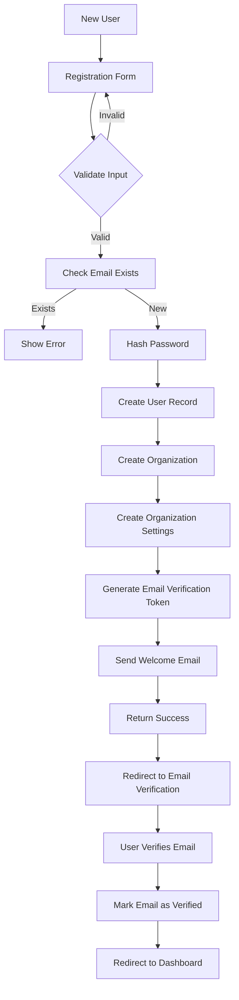

# FleetFlow Data Flow Diagrams

## Overview
This document provides detailed data flow diagrams for key processes in the FleetFlow system, showing how data moves between components, services, and databases.

---

## 1. User Registration & Onboarding Flow



### Data Flow Details:

**Step 1-2: Form Submission**
```json
{
  "email": "admin@company.com",
  "password": "SecureP@ss123",
  "firstName": "John",
  "lastName": "Doe",
  "organizationName": "ABC Logistics",
  "phone": "+1234567890"
}
```

**Step 7: User Record Created**
```json
{
  "id": "uuid-123",
  "email": "admin@company.com",
  "password_hash": "$2b$12$hashed_password",
  "first_name": "John",
  "last_name": "Doe",
  "role": "admin",
  "organization_id": "org-uuid-456",
  "is_active": true,
  "email_verified": false,
  "created_at": "2024-02-21T10:00:00Z"
}
```

---

## 2. Vehicle Management Flow

### 2.1 Add New Vehicle

```
┌──────────┐     ┌──────────┐     ┌──────────┐     ┌──────────┐
│  Admin   │     │   API    │     │ Services │     │ Database │
└──────────┘     └──────────┘     └──────────┘     └──────────┘
     │                 │                 │                 │
     │ 1. Submit Form  │                 │                 │
     ├────────────────>│                 │                 │
     │                 │                 │                 │
     │                 │ 2. Validate     │                 │
     │                 │    Vehicle Data │                 │
     │                 ├────────────────>│                 │
     │                 │                 │                 │
     │                 │                 │ 3. Check        │
     │                 │                 │    duplicate    │
     │                 │                 │    plate        │
     │                 │                 ├────────────────>│
     │                 │                 │                 │
     │                 │                 │ 4. No duplicate │
     │                 │                 │<────────────────┤
     │                 │                 │                 │
     │                 │ 5. Upload       │                 │
     │                 │    vehicle      │                 │
     │                 │    images       │                 │
     │                 │                 │                 │
     │                 │ 6. Store in S3  │                 │
     │                 │                 │                 │
     │                 │ 7. Get URLs     │                 │
     │                 │                 │                 │
     │                 │ 8. Create       │                 │
     │                 │    vehicle      │                 │
     │                 │    record       │                 │
     │                 │                 ├────────────────>│
     │                 │                 │                 │
     │                 │                 │ 9. Insert       │
     │                 │                 │<────────────────┤
     │                 │                 │                 │
     │                 │ 10. Create      │                 │
     │                 │     maintenance │                 │
     │                 │     schedule    │                 │
     │                 │                 ├────────────────>│
     │                 │                 │                 │
     │                 │ 11. Log activity│                 │
     │                 │                 ├────────────────>│
     │                 │                 │                 │
     │                 │ 12. Trigger     │                 │
     │                 │     notification│                 │
     │                 │                 │                 │
     │ 13. Return      │                 │                 │
     │     vehicle ID  │                 │                 │
     │<────────────────┤                 │                 │
     │                 │                 │                 │
     │ 14. Redirect to │                 │                 │
     │     vehicle page│                 │                 │
```

**Input Data:**
```json
{
  "vehicle_number": "VEH-001",
  "license_plate": "ABC-1234",
  "vin": "1HGBH41JXMN109186",
  "make": "Toyota",
  "model": "Camry",
  "year": 2023,
  "vehicle_type": "sedan",
  "fuel_type": "gasoline",
  "purchase_date": "2023-01-15",
  "images": ["base64_image_1", "base64_image_2"]
}
```

**Database Operations:**
1. INSERT into `vehicles` table
2. INSERT into `maintenance_schedules` table (default schedules)
3. INSERT into `activity_logs` table
4. INSERT into `notifications` table

---

## 3. Trip Lifecycle Flow

### 3.1 Complete Trip Lifecycle

```
Stages:
[Creation] -> [Assignment] -> [Acceptance] -> [In Progress] -> [Completion]

┌──────────────┐
│  CREATION    │
│  (Admin)     │
└──────────────┘
       │
       │ Create trip with:
       │ - Origin & Destination
       │ - Schedule
       │ - Cargo details
       │
       ▼
┌──────────────┐
│  CHECK       │
│  RESOURCES   │
└──────────────┘
       │
       │ Verify:
       │ - Available vehicles
       │ - Available drivers
       │ - No conflicts
       │
       ▼
┌──────────────┐
│  ASSIGNMENT  │
└──────────────┘
       │
       │ Assign:
       │ - Vehicle
       │ - Driver
       │ - Calculate route
       │
       ▼
┌──────────────┐
│ NOTIFICATION │
│ TO DRIVER    │
└──────────────┘
       │
       │ Send:
       │ - Push notification
       │ - SMS alert
       │ - Email
       │
       ▼
┌──────────────┐
│   DRIVER     │
│  ACCEPTANCE  │
└──────────────┘
       │
       ├──> [Reject] ──> Reassign
       │
       │ [Accept]
       ▼
┌──────────────┐
│   START      │
│   TRIP       │
└──────────────┘
       │
       │ - Mark actual start time
       │ - Enable GPS tracking
       │ - Start route navigation
       │
       ▼
┌──────────────┐
│ IN PROGRESS  │
│              │
│  Real-time   │
│  Tracking    │
└──────────────┘
       │
       │ Continuous:
       │ - GPS updates (30s)
       │ - Location broadcast
       │ - ETA calculation
       │
       ▼
┌──────────────┐
│  WAYPOINT    │
│  REACHED     │
└──────────────┘
       │
       │ For each waypoint:
       │ - Mark arrival
       │ - Capture photo (if required)
       │ - Get signature
       │ - Mark departure
       │
       ▼
┌──────────────┐
│ DESTINATION  │
│  REACHED     │
└──────────────┘
       │
       │ - Mark completion
       │ - Update vehicle mileage
       │ - Calculate final distance
       │ - Request rating
       │
       ▼
┌──────────────┐
│   COMPLETE   │
└──────────────┘
       │
       │ - Generate summary
       │ - Update statistics
       │ - Send notifications
       │ - Make vehicle available
```

### 3.2 Detailed Trip Creation Data Flow

**API Request:**
```http
POST /api/trips
Authorization: Bearer {token}
Content-Type: application/json

{
  "trip_type": "delivery",
  "priority": "high",
  "origin": {
    "address": "123 Warehouse St, City, State",
    "lat": 37.7749,
    "lng": -122.4194,
    "contact_name": "Warehouse Manager",
    "contact_phone": "+1234567890"
  },
  "destination": {
    "address": "456 Customer Ave, City, State",
    "lat": 37.8044,
    "lng": -122.2712,
    "contact_name": "John Customer",
    "contact_phone": "+0987654321"
  },
  "scheduled_start_time": "2024-02-21T14:00:00Z",
  "cargo_description": "Electronics package",
  "cargo_weight": 15.5,
  "customer_price": 150.00,
  "instructions": "Handle with care - fragile items"
}
```

**Processing Steps:**

1. **Validate Request**
```typescript
const schema = z.object({
  trip_type: z.enum(['delivery', 'pickup', 'passenger', 'service', 'other']),
  priority: z.enum(['low', 'medium', 'high', 'urgent']),
  origin: locationSchema,
  destination: locationSchema,
  scheduled_start_time: z.string().datetime(),
  // ... more fields
});
```

2. **Find Available Resources**
```sql
-- Find available vehicles
SELECT v.* 
FROM vehicles v
LEFT JOIN trips t ON v.id = t.vehicle_id 
  AND t.status IN ('scheduled', 'in_progress')
  AND t.scheduled_start_time BETWEEN $1 AND $2
WHERE v.organization_id = $3
  AND v.status = 'active'
  AND t.id IS NULL;

-- Find available drivers
SELECT d.* 
FROM drivers d
LEFT JOIN trips t ON d.id = t.driver_id 
  AND t.status IN ('scheduled', 'in_progress')
  AND t.scheduled_start_time BETWEEN $1 AND $2
WHERE d.organization_id = $3
  AND d.employment_status = 'active'
  AND t.id IS NULL;
```

3. **Calculate Route**
```javascript
// Call Google Maps Directions API
const routeData = await mapsAPI.getDirections({
  origin: trip.origin,
  destination: trip.destination,
  waypoints: trip.waypoints,
  optimize: true
});

const routeInfo = {
  planned_distance: routeData.routes[0].legs[0].distance.value / 1000, // km
  estimated_duration: routeData.routes[0].legs[0].duration.value / 60, // minutes
  route_polyline: routeData.routes[0].overview_polyline.points
};
```

4. **Create Trip Record**
```sql
INSERT INTO trips (
  organization_id,
  trip_number,
  vehicle_id,
  driver_id,
  trip_type,
  status,
  priority,
  origin_address,
  origin_lat,
  origin_lng,
  destination_address,
  destination_lat,
  destination_lng,
  scheduled_start_time,
  planned_distance,
  estimated_duration,
  route_polyline,
  cargo_description,
  cargo_weight,
  customer_price,
  instructions,
  created_by
) VALUES (
  $1, $2, $3, $4, $5, $6, $7, $8, $9, $10,
  $11, $12, $13, $14, $15, $16, $17, $18,
  $19, $20, $21, $22
)
RETURNING *;
```

5. **Send Notifications**
```typescript
// Push Notification to Driver
await notificationService.send({
  user_id: driver.user_id,
  type: 'trip_assigned',
  title: 'New Trip Assigned',
  message: `Trip #${trip.trip_number} scheduled for ${trip.scheduled_start_time}`,
  action_url: `/driver/trips/${trip.id}`,
  channels: ['push', 'sms']
});
```

---

## 4. Real-Time GPS Tracking Data Flow

### 4.1 Location Update Flow

```
┌──────────────┐      ┌──────────────┐      ┌──────────────┐
│   Driver     │      │     API      │      │    Redis     │
│   Mobile     │      │   Endpoint   │      │   Pub/Sub    │
└──────────────┘      └──────────────┘      └──────────────┘
       │                     │                      │
       │ Every 30 seconds    │                      │
       │                     │                      │
       ├────────────────────>│                      │
       │ POST /api/tracking  │                      │
       │ {                   │                      │
       │   trip_id,          │                      │
       │   lat,              │                      │
       │   lng,              │                      │
       │   speed,            │                      │
       │   heading,          │                      │
       │   accuracy,         │                      │
       │   timestamp         │                      │
       │ }                   │                      │
       │                     │                      │
       │                     │ 1. Validate data     │
       │                     │                      │
       │                     │ 2. Check trip status │
       │                     │                      │
       │                     │ 3. Publish to channel│
       │                     ├─────────────────────>│
       │                     │    Channel:          │
       │                     │    "trip:{trip_id}"  │
       │                     │                      │
       │                     │ 4. Store in cache    │
       │                     │    (last location)   │
       │                     │                      │
       │                     │ 5. Queue for DB save │
       │                     │    (batch insert)    │
       │                     │                      │
       │ 200 OK              │                      │
       │<────────────────────┤                      │
       │                     │                      │
```

### 4.2 Client Subscription Flow

```
┌──────────────┐      ┌──────────────┐      ┌──────────────┐
│   Admin      │      │  WebSocket   │      │    Redis     │
│  Dashboard   │      │   Server     │      │   Pub/Sub    │
└──────────────┘      └──────────────┘      └──────────────┘
       │                     │                      │
       │ 1. Connect WS       │                      │
       ├────────────────────>│                      │
       │                     │                      │
       │ 2. Subscribe to trip│                      │
       ├────────────────────>│                      │
       │    {                │                      │
       │      action:        │                      │
       │      "subscribe",   │                      │
       │      trip_id:       │                      │
       │      "123"          │                      │
       │    }                │                      │
       │                     │                      │
       │                     │ 3. Subscribe to Redis│
       │                     ├─────────────────────>│
       │                     │    Channel:          │
       │                     │    "trip:123"        │
       │                     │                      │
       │                     │ 4. Get last location │
       │                     │    from cache        │
       │                     │                      │
       │ 5. Send initial pos │                      │
       │<────────────────────┤                      │
       │                     │                      │
       │                     │ 6. New update arrives│
       │                     │<─────────────────────┤
       │                     │                      │
       │ 7. Broadcast to     │                      │
       │    client           │                      │
       │<────────────────────┤                      │
       │                     │                      │
       │ 8. Update map       │                      │
       │    marker           │                      │
       │                     │                      │
```

### 4.3 Batch Database Insert

```
┌──────────────┐      ┌──────────────┐      ┌──────────────┐
│   Redis      │      │  Background  │      │   Database   │
│   Queue      │      │     Job      │      │              │
└──────────────┘      └──────────────┘      └──────────────┘
       │                     │                      │
       │ Locations queued    │                      │
       │ (100 updates)       │                      │
       │                     │                      │
       │                     │ Every 60 seconds     │
       │                     │ or 100 records       │
       │                     │                      │
       │ Bulk insert job     │                      │
       ├────────────────────>│                      │
       │                     │                      │
       │                     │ Process batch        │
       │                     │                      │
       │                     │ INSERT INTO          │
       │                     │ trip_tracking        │
       │                     │ VALUES (...)         │
       │                     ├─────────────────────>│
       │                     │                      │
       │                     │ Rows inserted        │
       │                     │<─────────────────────┤
       │                     │                      │
       │                     │ Update vehicle       │
       │                     │ current_location     │
       │                     ├─────────────────────>│
       │                     │                      │
       │ Job complete        │                      │
       │<────────────────────┤                      │
```

---

## 5. Maintenance Management Flow

### 5.1 Scheduled Maintenance Check

```
┌──────────────┐      ┌──────────────┐      ┌──────────────┐
│   Cron Job   │      │   Service    │      │   Database   │
│  (Daily 6AM) │      │              │      │              │
└──────────────┘      └──────────────┘      └──────────────┘
       │                     │                      │
       │ Trigger             │                      │
       ├────────────────────>│                      │
       │                     │                      │
       │                     │ Query all schedules  │
       │                     ├─────────────────────>│
       │                     │                      │
       │                     │ Return schedules     │
       │                     │<─────────────────────┤
       │                     │                      │
       │                     │ For each schedule:   │
       │                     │                      │
       │                     │ Check if due:        │
       │                     │ - By date            │
       │                     │ - By mileage         │
       │                     │                      │
       │                     │ If due in 7 days:    │
       │                     │                      │
       │                     │ Create notification  │
       │                     ├─────────────────────>│
       │                     │                      │
       │                     │ Send to managers     │
       │                     │ - Email              │
       │                     │ - Dashboard          │
       │                     │                      │
       │                     │ Update vehicle status│
       │                     │ to "maintenance_due" │
       │                     ├─────────────────────>│
       │                     │                      │
       │ Complete            │                      │
       │<────────────────────┤                      │
```

### 5.2 Record Maintenance Completion

```
User Input -> Validate -> Create Record -> Update Schedule -> Update Vehicle
```

**Flow:**
1. Manager submits maintenance form
2. System validates:
   - Vehicle exists
   - Valid costs
   - Valid dates
3. Create maintenance_record
4. Update next service date in schedule
5. Update vehicle last_service_mileage
6. Log activity
7. Clear maintenance_due status
8. Send confirmation notification

**Data Example:**
```json
{
  "vehicle_id": "vehicle-uuid",
  "maintenance_type": "routine",
  "service_category": "Oil Change",
  "service_date": "2024-02-21",
  "service_mileage": 15000,
  "parts_cost": 50.00,
  "labor_cost": 75.00,
  "total_cost": 125.00,
  "provider_name": "ABC Auto Service",
  "notes": "Full synthetic oil used"
}
```

---

## 6. Fuel Record Flow

### 6.1 Driver Logs Fuel

```
┌──────────────┐      ┌──────────────┐      ┌──────────────┐
│   Driver     │      │     API      │      │   Database   │
│   Mobile     │      │              │      │              │
└──────────────┘      └──────────────┘      └──────────────┘
       │                     │                      │
       │ 1. Open fuel form   │                      │
       │    - Scan receipt   │                      │
       │    - OCR extraction │                      │
       │                     │                      │
       │ 2. Submit fuel data │                      │
       ├────────────────────>│                      │
       │ {                   │                      │
       │   vehicle_id,       │                      │
       │   quantity: 45.5,   │                      │
       │   price_per_unit:   │                      │
       │     1.85,           │                      │
       │   total_cost: 84.17,│                      │
       │   odometer: 15234,  │                      │
       │   station_name,     │                      │
       │   receipt_image     │                      │
       │ }                   │                      │
       │                     │                      │
       │                     │ 3. Validate data     │
       │                     │                      │
       │                     │ 4. Get last fuel     │
       │                     │    record            │
       │                     ├─────────────────────>│
       │                     │                      │
       │                     │ Last record          │
       │                     │<─────────────────────┤
       │                     │                      │
       │                     │ 5. Calculate:        │
       │                     │    - Distance driven │
       │                     │    - Fuel efficiency │
       │                     │                      │
       │                     │ 6. Upload receipt    │
       │                     │    to S3             │
       │                     │                      │
       │                     │ 7. Create fuel record│
       │                     ├─────────────────────>│
       │                     │                      │
       │                     │ 8. Update vehicle    │
       │                     │    mileage           │
       │                     ├─────────────────────>│
       │                     │                      │
       │                     │ 9. Update avg        │
       │                     │    consumption       │
       │                     ├─────────────────────>│
       │                     │                      │
       │ 10. Success response│                      │
       │<────────────────────┤                      │
       │                     │                      │
       │ 11. Show            │                      │
       │     confirmation    │                      │
```

**Calculations:**
```typescript
// Distance since last fuel
const distanceSinceLastFuel = currentOdometer - lastFuelRecord.odometer_reading;

// Fuel efficiency (km per liter)
const fuelEfficiency = distanceSinceLastFuel / lastFuelRecord.quantity;

// Update vehicle average consumption
const newAverage = calculateMovingAverage(
  vehicle.average_fuel_consumption,
  fuelEfficiency,
  vehicle.total_fuel_records
);
```

---

## 7. Incident Reporting Flow

### 7.1 Incident Report Submission

```
Driver Reports -> Photos/Details -> Create Incident -> Notify Management
                                                    -> Assign Investigator
                                                    -> Track Resolution
```

**Detailed Flow:**

```
┌──────────────┐      ┌──────────────┐      ┌──────────────┐
│   Driver     │      │   System     │      │  Management  │
└──────────────┘      └──────────────┘      └──────────────┘
       │                     │                      │
       │ 1. Incident occurs  │                      │
       │    - Stop vehicle   │                      │
       │    - Assess damage  │                      │
       │                     │                      │
       │ 2. Open incident    │                      │
       │    report form      │                      │
       │                     │                      │
       │ 3. Fill details:    │                      │
       │    - Type           │                      │
       │    - Severity       │                      │
       │    - Description    │                      │
       │    - Take photos    │                      │
       │    - Record location│                      │
       │                     │                      │
       │ 4. Submit report    │                      │
       ├────────────────────>│                      │
       │                     │                      │
       │                     │ 5. Generate          │
       │                     │    incident number   │
       │                     │                      │
       │                     │ 6. Upload photos     │
       │                     │                      │
       │                     │ 7. Create incident   │
       │                     │    record            │
       │                     │                      │
       │                     │ 8. Determine severity│
       │                     │                      │
       │                     │ 9. Send urgent alert │
       │                     │    if critical       │
       │                     ├─────────────────────>│
       │                     │    SMS + Email       │
       │                     │                      │
       │                     │ 10. Create tasks:    │
       │                     │     - Investigation  │
       │                     │     - Insurance claim│
       │                     │     - Vehicle check  │
       │                     │                      │
       │                     │ 11. Update vehicle   │
       │                     │     status           │
       │                     │                      │
       │ 12. Confirmation    │                      │
       │     + incident #    │                      │
       │<────────────────────┤                      │
       │                     │                      │
       │                     │                      │12. Review incident
       │                     │                      │
       │                     │ 13. Request info     │
       │                     │<─────────────────────┤
       │                     │                      │
       │ 14. Provide details │                      │
       │<────────────────────┤                      │
       │                     │                      │
```

---

## 8. Report Generation Flow

### 8.1 Fleet Utilization Report

```
Request Report -> Define Parameters -> Query Database -> Process Data
                                                      -> Generate Charts
                                                      -> Export File
                                                      -> Send/Download
```

**Detailed Process:**

1. **User Request:**
```json
{
  "report_type": "fleet_utilization",
  "period_start": "2024-01-01",
  "period_end": "2024-01-31",
  "filters": {
    "vehicle_ids": ["v1", "v2", "v3"],
    "include_charts": true
  },
  "format": "pdf"
}
```

2. **Data Queries:**
```sql
-- Total trips per vehicle
SELECT 
  v.id,
  v.vehicle_number,
  COUNT(t.id) as total_trips,
  SUM(t.actual_distance) as total_distance,
  AVG(EXTRACT(EPOCH FROM (t.actual_end_time - t.actual_start_time))/3600) as avg_trip_hours
FROM vehicles v
LEFT JOIN trips t ON v.id = t.vehicle_id
WHERE t.actual_start_time BETWEEN $1 AND $2
  AND t.status = 'completed'
GROUP BY v.id;

-- Maintenance costs
SELECT 
  v.id,
  SUM(m.total_cost) as maintenance_cost
FROM vehicles v
LEFT JOIN maintenance_records m ON v.id = m.vehicle_id
WHERE m.service_date BETWEEN $1 AND $2
GROUP BY v.id;

-- Fuel costs
SELECT 
  v.id,
  SUM(f.total_cost) as fuel_cost,
  SUM(f.quantity) as total_fuel
FROM vehicles v
LEFT JOIN fuel_records f ON v.id = f.vehicle_id
WHERE f.fuel_date BETWEEN $1 AND $2
GROUP BY v.id;
```

3. **Data Processing:**
```typescript
// Calculate utilization metrics
const utilizationReport = vehicles.map(vehicle => {
  const totalDaysInPeriod = daysBetween(startDate, endDate);
  const activeDays = vehicle.trips.filter(t => t.status === 'completed').length;
  const utilizationRate = (activeDays / totalDaysInPeriod) * 100;
  
  const totalCost = vehicle.maintenance_cost + vehicle.fuel_cost;
  const costPerKm = totalCost / vehicle.total_distance;
  
  return {
    vehicle_number: vehicle.vehicle_number,
    total_trips: vehicle.total_trips,
    total_distance: vehicle.total_distance,
    utilization_rate: utilizationRate,
    total_cost: totalCost,
    cost_per_km: costPerKm,
    avg_trip_hours: vehicle.avg_trip_hours
  };
});
```

4. **Generate Report:**
- Create PDF with charts (using libraries like pdfkit)
- Include executive summary
- Detailed metrics per vehicle
- Comparison charts
- Recommendations

5. **Store & Deliver:**
- Save PDF to S3
- Create record in `reports` table
- Send email with download link
- Make available in dashboard

---

## 9. Notification System Flow

### 9.1 Multi-Channel Notification

```
Trigger Event -> Create Notification -> Determine Recipients -> Send Channels
                                                                - Email
                                                                - SMS
                                                                - Push
                                                                - In-App
```

**Event Processing:**

```typescript
// Example: Maintenance Due Event
async function handleMaintenanceDueEvent(vehicle: Vehicle, schedule: MaintenanceSchedule) {
  // 1. Create notification record
  const notification = await createNotification({
    organization_id: vehicle.organization_id,
    notification_type: 'maintenance_due',
    priority: 'high',
    title: `Maintenance Due: ${vehicle.vehicle_number}`,
    message: `${schedule.service_category} is due on ${schedule.next_service_date}`,
    related_entity_type: 'vehicle',
    related_entity_id: vehicle.id
  });
  
  // 2. Determine recipients based on alert rules
  const alertRule = await getAlertRule(vehicle.organization_id, 'maintenance');
  const recipients = await getRecipients(alertRule);
  
  // 3. Send through configured channels
  for (const channel of alertRule.notification_channels) {
    switch (channel) {
      case 'email':
        await emailService.send({
          to: recipients.map(r => r.email),
          subject: notification.title,
          template: 'maintenance_due',
          data: { vehicle, schedule }
        });
        break;
        
      case 'sms':
        for (const recipient of recipients) {
          await smsService.send({
            to: recipient.phone,
            message: notification.message
          });
        }
        break;
        
      case 'push':
        for (const recipient of recipients) {
          await pushService.send({
            user_id: recipient.id,
            title: notification.title,
            body: notification.message,
            data: { notification_id: notification.id }
          });
        }
        break;
        
      case 'dashboard':
        // Already created in database
        // WebSocket will broadcast to connected users
        await broadcastToUsers(recipients, notification);
        break;
    }
  }
  
  // 4. Log notification sent
  await logActivity({
    action: 'notification_sent',
    entity_type: 'notification',
    entity_id: notification.id,
    description: `Sent via ${alertRule.notification_channels.join(', ')}`
  });
}
```

---

## 10. Data Synchronization Flow

### 10.1 Mobile App Offline Sync

```
┌──────────────┐      ┌──────────────┐      ┌──────────────┐
│   Mobile     │      │   Sync API   │      │   Database   │
│   (Offline)  │      │              │      │              │
└──────────────┘      └──────────────┘      └──────────────┘
       │                     │                      │
       │ App detects offline │                      │
       │                     │                      │
       │ Store changes       │                      │
       │ locally (SQLite)    │                      │
       │                     │                      │
       │ - Trip updates      │                      │
       │ - Fuel records      │                      │
       │ - Photos            │                      │
       │                     │                      │
       │ App back online     │                      │
       │                     │                      │
       │ POST /api/sync      │                      │
       ├────────────────────>│                      │
       │ {                   │                      │
       │   last_sync:        │                      │
       │     timestamp,      │                      │
       │   pending_changes:  │                      │
       │     [...]           │                      │
       │ }                   │                      │
       │                     │                      │
       │                     │ 1. Validate changes  │
       │                     │                      │
       │                     │ 2. Check conflicts   │
       │                     │                      │
       │                     │ 3. Resolve conflicts │
       │                     │    (server wins)     │
       │                     │                      │
       │                     │ 4. Apply changes     │
       │                     ├─────────────────────>│
       │                     │                      │
       │                     │ 5. Get server changes│
       │                     │<─────────────────────┤
       │                     │                      │
       │ 6. Return:          │                      │
       │    - Applied changes│                      │
       │    - Server updates │                      │
       │    - Conflicts      │                      │
       │<────────────────────┤                      │
       │                     │                      │
       │ 7. Update local DB  │                      │
       │                     │                      │
       │ 8. Clear pending    │                      │
       │    changes          │                      │
```

---

## Summary

This document provides comprehensive data flow diagrams for all major processes in FleetFlow:

1. ✅ User Registration & Onboarding
2. ✅ Vehicle Management
3. ✅ Complete Trip Lifecycle
4. ✅ Real-Time GPS Tracking
5. ✅ Maintenance Management
6. ✅ Fuel Record Management
7. ✅ Incident Reporting
8. ✅ Report Generation
9. ✅ Multi-Channel Notifications
10. ✅ Offline Data Synchronization

Each flow includes:
- Visual diagrams
- Data structures
- API contracts
- Database operations
- Business logic
- Error handling considerations

These flows serve as the blueprint for implementing the FleetFlow system.
